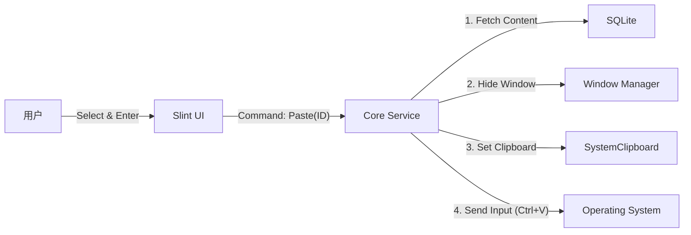

# System Architecture Design

## 1. 架构概览 (Architecture Overview)
PICAclip 采用 **Core-UI 分离** 的双层架构模式。为了保证界面流畅性和业务逻辑的稳定性，核心业务逻辑（剪贴板监听、数据库读写、系统交互）运行在独立的后台线程/Runtime中，而 UI 渲染层则由 Slint 框架在主线程接管。

## 2. 进程/线程模型 (Process/Threading Model)

### 2.1 主线程 (Main Thread / UI Thread)
- **职责**: 负责 Slint UI 的渲染、事件响应 (点击、键盘输入)、窗口管理。
- **约束**: 严禁执行耗时操作 (如大文件 I/O、网络请求、长时间的数据库查询)。所有耗时任务必须通过 Channel 委托给 Core 线程。

### 2.2 核心服务线程 (Core Service Thread / Tokio Runtime)
- **职责**: 
  - 运行 Tokio Async Runtime。
  - **Clipboard Monitor**: 持续监听系统剪贴板变化。
  - **Database Manager**: 处理所有 SQLite 的读写请求。
  - **System Integrator**: 处理全局快捷键、模拟键盘输入、托盘图标管理。
- **通信**: 通过 Rust 的 `mpsc` (Multi-Producer, Single-Consumer) channel 或 Slint 提供的线程安全回调机制与 UI 线程通信。

## 3. 数据流设计 (Data Flow)

### 3.1 剪贴板监听与存储流程
```mermaid
graph LR
    SystemClipboard[系统剪贴板] -- Change Event --> Monitor[Clipboard Monitor (Core)]
    Monitor -- 1. Read & Process --> Filter[Filter & Clean]
    Filter -- 2. Valid Data --> DB[SQLite Database]
    DB -- 3. Insert Success --> EventBus[Event Bus]
    EventBus -- 4. Notify Update --> UI[Slint UI]
    UI -- 5. Query Recent --> DB
```

1.  **Monitor**: `arboard` 库结合平台特定 API (如 Windows `AddClipboardFormatListener`) 监听变化。
2.  **Filter**: 执行去重、黑名单检查、敏感词过滤。
3.  **Persist**: 存入 SQLite。图片转存为文件。
4.  **Notify**: 通过 `slint::Weak` 句柄调用 `invoke_from_event_loop` 通知 UI 刷新列表。

### 3.2 用户操作流 (模拟粘贴)


## 4. 关键技术细节

### 4.1 通信机制 (Communication)
- **UI -> Core**: 使用 `tokio::sync::mpsc::Sender<AppCommand>`。
    - `AppCommand` 枚举定义所有操作，如 `Search(String)`, `PasteItem(i64)`, `UpdateSnippet(...)`。
- **Core -> UI**: 使用 `slint::Weak<AppWindow>` 句柄。
    - 在 Core 中持有 UI 句柄的弱引用，通过 `invoke_from_event_loop` 闭包更新 Slint 的 Model (如 `VecModel`)。

### 4.2 数据库访问 (Database Access)
- 使用 `sqlx` (异步) 或 `rusqlite` (同步，但在 Tokio `spawn_blocking` 中运行)。鉴于 Slint 极低内存目标，推荐 **`rusqlite`** 配合连接池 (如 `r2d2` 或简单的 `Mutex<Connection>`)，因为 `sqlx` 编译产物较大且运行时开销相对略高。
- 全文搜索：利用 SQLite FTS5 模块构建 `history_fts` 和 `snippets_fts` 虚拟表，实现统一搜索。

### 4.3 加密策略 (Encryption Strategy)
针对 `Snippets` 模块中的敏感数据：
- **算法**: AES-256-GCM (Authenticated Encryption)。
- **Key Management**: 
    - 简单模式：硬编码混淆 Key (仅防君子)。
    - 安全模式：用户首次启动设置 Master Password -> PBKDF2/Argon2 派生 Key -> 存入 OS Keyring (Windows Credential Manager)。
    - 本项目初期可采用 **本地配置文件混淆存储 Key** 的方式，平衡易用性与基础安全性。
- **Scope**: 仅加密 `snippets` 表中 `is_masked = 1` 的记录的 `content` 字段。

### 4.4 窗口管理策略 (Window Management Strategy)

系统存在两个主要的 UI 实体，需分别管理其生命周期：

#### 4.4.1 主悬浮窗 (Main Floating Window)
- **特性**: `AlwaysOnTop`, `Frameless` (无边框), `SkipTaskbar`.
- **生命周期**: 
    - 启动时创建但隐藏。
    - 按下快捷键 -> `Show()` + `SetFocus()` + `UpdatePosition()`.
    - 失去焦点 (`Blur` 事件) -> `Hide()`.
- **定位**: 每次呼出时，通过 Windows API (`GetCursorPos`) 获取鼠标位置，计算窗口坐标，确保窗口出现在鼠标附近（类似 Win+V 或 Context Menu）。
- **焦点**: 呼出时通过 `SetForegroundWindow` 强制获取焦点。

#### 4.4.2 设置窗口 (Settings Window)
- **特性**: 标准窗口 (`Decorated`), 显示在任务栏.
- **生命周期**:
    - 懒加载：首次点击“设置”时创建。
    - 点击关闭按钮 -> `Hide()` (不销毁，保留状态) 或 `Close()` (视资源占用而定)。
- **交互**: 通过托盘菜单 (`Tray Menu`) 或主窗口按钮唤起。

- **全局快捷键**:
    - 使用 `global-hotkey` crate (或 Windows API `RegisterHotKey`) 注册 `Ctrl+Shift+V` (或其他配置键)。
    - 快捷键事件由 Core 线程捕获，通过 Channel 发送 `ShowUI` 指令给 UI 线程。

## 5. 目录结构映射
- `src/main.rs`: 程序入口，初始化 Slint 和 Tokio Runtime。
- `src/core/`: 包含 `monitor.rs`, `db.rs`, `clipboard.rs`。
- `src/ui/`: 包含 `.slint` 文件和对应的 Rust code-behind。
